# 电商用户行为漏斗分析与转化建模

对一份电商网站会话级行为数据（100,000 条会话、13 个字段）做完整的转化分析：从数据探查、清洗、入库，到单变量分布、漏斗拆解、分层下钻、交叉分析，最后用列联表检验和逻辑回归量化各因素与转化的关系。

**转化口径**：以 `confirmation_page = 1`（走完漏斗到达确认页）作为转化终点。需要说明的是，该字段的含义是"到达确认页"，并不等同于"支付成功"，全文的"转化率"均按此口径计算。

---

## 目录

- [一、项目背景与业务问题](#一项目背景与业务问题)
- [二、数据说明](#二数据说明)
- [三、项目结构与运行环境](#三项目结构与运行环境)
- [四、步骤 1｜数据探查](#四步骤-1数据探查)
- [五、步骤 2｜数据清洗](#五步骤-2数据清洗)
- [六、步骤 3｜数据入库](#六步骤-3数据入库)
- [七、步骤 4｜单变量分布分析](#七步骤-4单变量分布分析)
- [八、步骤 5｜转化漏斗分析](#八步骤-5转化漏斗分析)
- [九、步骤 6｜单项平均转化率](#九步骤-6单项平均转化率)
- [十、步骤 7｜交叉分析](#十步骤-7交叉分析)
- [十一、步骤 8｜列联表与卡方检验](#十一步骤-8列联表与卡方检验)
- [十二、步骤 9｜逻辑回归建模](#十二步骤-9逻辑回归建模)
- [十三、步骤 10｜用户画像分析](#十三步骤-10用户画像分析)
- [十四、主要结论](#十四主要结论)
- [十五、优化建议](#十五优化建议)

---

## 一、项目背景与业务问题

一个电商网站每天产生大量用户会话，但真正走完"首页 → 列表页 → 商品详情页 → 支付页 → 确认页"这条路径的会话只是少数。业务方关心的不是"转化率是多少"这个数字本身，而是**资源应该投在哪一环**：推荐算法、搜索、商品运营、交易、履约这几个团队，谁的问题更大、改动谁收益最高。

沿着这个目标，一个完整的数据分析任务包含三步：

| 环节 | 回答的问题 |
| --- | --- |
| 现状量化 | 整体转化率是多少？ |
| 问题定位 | 哪一段流失最严重？ |
| 分层下钻 | 哪类人群的问题更突出？ |

这三步就是本项目的范围，重点在于把漏斗拆开、把人群分层，并用统计方法区分"真实差异"和"样本波动"。

数据中的一个关键设定：**一行数据代表一次网站会话（session），不是一个人**。数据里没有 `user_id`，所以本项目的所有比率都是"会话转化率"而非"用户转化率"。这两者在大多数场景下数值接近，但如果一个用户多次访问，含义完全不同——这一点在解读结果时必须时刻记住。

---

## 二、数据说明

原始数据：`用户行为分析.csv`，100,000 行 × 13 列。

| 字段名 | 含义 | 取值 |
| --- | --- | --- |
| new_user | 是否新用户 | 1 = 新用户，0 = 老用户 |
| age | 年龄 | 整数 |
| sex | 性别 | Female / Male（另有 `'0'`） |
| market | 市场编号 | 1 / 2 / 3 / 4 |
| device | 设备类型 | mobile / desktop（另有 `'0'`） |
| operative_system | 操作系统 | windows / iOS / android / mac / linux / other（另有 `'0'`） |
| source | 流量来源渠道 | Direct / Seo / Ads（另有 `'0'`） |
| total_pages_visited | 本次会话浏览的页面总数 | 整数 |
| home_page | 是否到达首页 | 0 / 1 |
| listing_page | 是否到达列表页 | 0 / 1 |
| product_page | 是否到达商品详情页 | 0 / 1 |
| payment_page | 是否到达支付页 | 0 / 1 |
| confirmation_page | 是否到达确认页 | 0 / 1 |

数据本身干净得有些反常：**全表 0 个缺失值（NaN）**。但缺失并没有消失，而是被藏进了几个分类字段里——`sex`、`device`、`operative_system`、`source` 中都混着一个字符串 `'0'`，它不是任何合法取值，而是缺失值的占位符（俗称哨兵值）。这类"假干净"的数据比直接给出 NaN 的更危险，因为它不会触发任何缺失值检查。

另一个需要留意的地方是 `home_page` 这一列：它在 100,000 行里**恒等于 1**。也就是说每一次会话都到达了首页，这个字段不携带任何信息，漏斗的真正入口应该从"首页 → 列表页"这一段算起。

---

## 三、项目结构与运行环境

```
项目1/
├── code/                          # 分析脚本，按执行顺序编号
│   ├── 00_data_overview.py        # 数据探查
│   ├── 01_data_cleaning.py        # 数据清洗
│   ├── 02_load_to_mysql.py        # 数据入库
│   ├── 03_sql_select.sql          # 单变量占比与各维度转化率的 SQL
│   ├── 03_pie_charts.py           # 单变量分布饼图
│   ├── 04_cross_bar_charts.py     # 交叉分析图（含交互项检验）
│   ├── 05_contingency_analysis.py # 列联表与卡方检验
│   ├── 06_logistic_regression.py  # 逻辑回归建模
│   └── 07_user_profile.py         # 转化人群画像气泡图
├── pic/                           # 全部图表输出（13 张）
└── README.md
```

以下文件只保留在本地，未纳入仓库：`用户行为分析.csv`（原始数据，体积较大且来自公开项目）、`用户行为分析_cleaned.csv`（清洗结果，由 `01` 生成）、`.env`（含数据库口令）、`.env.example`、`.gitignore`，以及 `docs/数据随记.md`（字段字典与逐阶段观察记录）、`复现辅助资料.md`（逐步注意事项与深入方向）、`提示词记录.md`（提示词存档）。

**运行环境**

- Python：conda 环境 `python31111`
- 数据库：MySQL 8.0.45，库名 `project1_users`，表名 `user_action`
- 主要依赖：`pandas 3.0.3`、`numpy 2.4.6`、`scipy 1.17.1`、`statsmodels 0.15.0`、`scikit-learn 1.9.0`、`SQLAlchemy 2.0.50`、`PyMySQL 1.2.3`、`python-dotenv`

**数据库口令的脱敏**

口令不写在代码里，而是放在项目根目录的 `.env`：

```
DB_HOST=127.0.0.1
DB_PORT=3306
DB_USER=root
DB_PASSWORD=<你的口令>
DB_NAME=project1_users
```

口令不写在代码里。克隆本仓库后，在项目根目录自行新建一个 `.env`，按下面的字段填好自己的连接信息即可，`.gitignore` 会把该文件排除在版本控制之外。

**执行顺序**

```bash
python code/00_data_overview.py
python code/01_data_cleaning.py
python code/02_load_to_mysql.py
python code/03_pie_charts.py
python code/04_cross_bar_charts.py
python code/05_contingency_analysis.py
python code/06_logistic_regression.py
python code/07_user_profile.py
```

`01` 生成清洗后的 csv，`02` 把它写入 MySQL，`03` 之后的脚本全部从 MySQL 读取数据。

**数据从哪来**

原始数据 `用户行为分析.csv`（100,000 行 × 13 列）来自和鲸社区的公开项目[《基于 Python + MySQL + Tableau 的用户行为分析报告》](https://www.heywhale.com/mw/project/6a1272cdabaaf90e1e43c61f/content)，请自行下载后放到项目根目录，脚本即可直接跑通。这个文件体积约 4.5 MB 且非本项目产出，因此**没有放进仓库**；清洗结果 `用户行为分析_cleaned.csv` 由 `code/01_data_cleaning.py` 生成，同样不入库。项目在原始报告的步骤之上补做了列联表检验、逻辑回归建模和交互项检验三步，这部分是原报告没有的。

---

## 四、步骤 1｜数据探查

**目标**：在做任何处理之前，先弄清楚每一列到底是什么、有哪些取值、有没有明显异常。

**核心代码**（`code/00_data_overview.py`）

```python
df = pd.read_csv(DATA_PATH)

print('\n字段：', df.columns.tolist())
print('\n前 5 行数据：')
print(df.head())
print('\n字段类型：')
print(df.dtypes)

# 逐个字段看取值：低基数直接列出全部取值，高基数用 describe 看分布
for col in df.columns:
    n_unique = df[col].nunique()
    print(f'\n[{col}]  dtype={df[col].dtype}  唯一值数={n_unique}')
    if n_unique <= 20:
        print(df[col].value_counts().to_string())
    else:
        print(df[col].describe().to_string())
```

这里用了一个简单规则：唯一值不超过 20 个的字段直接把取值列全，超过的（`age` 53 个、`total_pages_visited` 28 个）改用 `describe()` 看分布形态。

**输出与发现**

| 字段 | 取值 |
| --- | --- |
| new_user | 0：68475，1：31525 |
| age | 17 ~ 123，均值 30.4，中位数 30，75% 分位 36 |
| sex | Female 60554，Male 38673，`0` 773 |
| market | 1：58094，2：17795，3：17890，4：6221 |
| device | mobile 60364，desktop 39503，`0` 133 |
| operative_system | windows 29700，iOS 28570，android 27328，mac 8552，other 4446，linux 1187，`0` 217 |
| source | Direct 56688，Seo 28337，Ads 14852，`0` 123 |
| total_pages_visited | 1 ~ 28，均值 5.91，中位数 5 |
| home_page | 全是 1 |
| listing_page | 1：73894，0：26106 |
| product_page | 1：49618，0：50382 |
| payment_page | 1：6862，0：93138 |
| confirmation_page | 1：2404，0：97596 |

三个需要在下一步处理的问题：

**`age` 存在极端值**。最大值 123 岁，而均值 30.4、中位数 30、75% 分位 36，最大值明显脱离了主体分布。17 岁这个下界则相对合理，可能是真实的最低年龄。

**四个分类字段存在哨兵值 `'0'`**。合计 1,242 行受影响（`sex` 773、`device` 133、`operative_system` 217、`source` 123，有少量行重复命中）。这些 `'0'` 不是类别，是缺失占位。

**`total_pages_visited` 存在长尾**。中位数只有 5，但最大值到 28。这类计数字段的极端值往往对应爬虫、误点或异常会话，是清洗时要处理的对象。

值得单独一提的是 `home_page` 恒为 1。这不是"数据质量好"，而是说明这个字段没有筛选作用——它意味着漏斗的第一段流失并不发生在进入网站之前，实际的第一道关卡是首页 → 列表页。

---

## 五、步骤 2｜数据清洗

**目标**：把上一步发现的三个问题处理掉，并记录清洗前后的维度变化。

**核心代码**（`code/01_data_cleaning.py`）

```python
df = pd.read_csv(DATA_PATH)
print('\n清洗前维度：', df.shape)

# 1) total_pages_visited：仅保留小于 99 分位数的值
q99 = df['total_pages_visited'].quantile(0.99)
print('\ntotal_pages_visited 的 99 分位数：', q99)
df = df[df['total_pages_visited'] < q99]
print('剔除 total_pages_visited >= 99 分位数后维度：', df.shape)

# 2) 含哨兵值 '0' 的字段：剔除这些行
SENTINEL_COLS = ['sex', 'device', 'operative_system', 'source']
sentinel_mask = df[SENTINEL_COLS].isin(['0']).any(axis=1)
print('\n命中哨兵值的行数：', int(sentinel_mask.sum()))
df = df[~sentinel_mask]
print('剔除哨兵值行后维度：', df.shape)

# 3) age：保留 0-100 的数据
age_mask = df['age'].between(0, 100)
print('\nage 不在 0-100 区间内的行数：', int((~age_mask).sum()))
df = df[age_mask]
print('剔除 age 异常值后维度：', df.shape)

print('\n清洗后维度：', df.shape)

OUT_PATH = Path(__file__).resolve().parent.parent / "用户行为分析_cleaned.csv"
df.to_csv(OUT_PATH, index=False)
print('已保存至：', OUT_PATH)
```

**维度变化**

| 阶段 | 维度 | 剔除行数 |
| --- | --- | --- |
| 清洗前 | (100000, 13) | — |
| 剔除 `total_pages_visited >= 20` | (98509, 13) | 1491 |
| 剔除哨兵值行 | (97276, 13) | 1233 |
| 剔除 `age` 不在 0-100 | (97274, 13) | 2 |
| **清洗后** | **(97274, 13)** | **共 2726（2.73%）** |

**分析**

`total_pages_visited` 的 99 分位数是 20，由于用的是严格小于，取值恰好等于 20 的行也被一并剔除了。这一步去掉了 1,491 行。

**一个值得停下来看的地方**：三条清洗规则里，`age` 那条在文档里听起来最像"处理异常值"，但它实际只剔掉了 **2 行**；而哨兵值那条剔掉了 1,233 行，是它的六百多倍。异常值处理在报告里往往被写得很重（因为方法论上好看），但对结果的实际影响力差别可能极大。判断一条清洗规则值不值得写进报告，应该看它改变了多少数据，而不是看它在方法上有多标准。

**另一个容易被忽略的点是处理顺序**。这里的顺序是：先按分位数筛 `total_pages_visited`，再删哨兵值行，最后处理 `age`。顺序会影响结果——如果先删哨兵值行，q99 会基于 98,767 行重新计算，切点可能不同。本项目的做法是让三步依次作用，因此每一步的分位数都是在前一步的结果上算的。

清洗后的数据保存为 `用户行为分析_cleaned.csv`，用 `index=False` 写出，读回来仍是 13 列。

---

## 六、步骤 3｜数据入库

**目标**：把清洗后的数据写入 MySQL，为后续用 SQL 做分析做准备。

**核心代码**（`code/02_load_to_mysql.py`）

```python
load_dotenv(ROOT / ".env")

engine = create_engine(
    "mysql+pymysql://"
    f"{DB_USER}:{quote_plus(DB_PASSWORD)}@{DB_HOST}:{DB_PORT}/{DB_NAME}?charset=utf8mb4"
)

df = pd.read_csv(ROOT / "用户行为分析_cleaned.csv")
print('\n待入库数据维度：', df.shape)

DDL = f"""
DROP TABLE IF EXISTS {TABLE};
CREATE TABLE {TABLE} (
    new_user            TINYINT     COMMENT '是否新用户，1=新 0=老',
    age                 TINYINT     COMMENT '年龄',
    sex                 VARCHAR(10) COMMENT '性别',
    market              TINYINT     COMMENT '市场编号',
    device              VARCHAR(20) COMMENT '设备类型',
    operative_system    VARCHAR(20) COMMENT '操作系统',
    source              VARCHAR(20) COMMENT '流量来源渠道',
    total_pages_visited SMALLINT    COMMENT '本次会话浏览页面总数',
    home_page           TINYINT     COMMENT '是否到达首页',
    listing_page        TINYINT     COMMENT '是否到达列表页',
    product_page        TINYINT     COMMENT '是否到达商品详情页',
    payment_page        TINYINT     COMMENT '是否到达支付页',
    confirmation_page   TINYINT     COMMENT '是否到达确认页'
) ENGINE=InnoDB DEFAULT CHARSET=utf8mb4 COMMENT='电商会话行为数据';
"""

with engine.begin() as conn:
    for stmt in [s for s in DDL.split(';') if s.strip()]:
        conn.execute(text(stmt))

df.to_sql(TABLE, engine, if_exists='append', index=False, chunksize=5000)
```

**结果**：表 `user_action` 建成，13 个字段，97,274 行全部写入，数据库计数与 csv 行数一致。

**分析**

建表语句里显式指定了字段类型，而不是让 pandas 自动推断。这样做的好处是：标志位统一用 `TINYINT`、文本用定长 `VARCHAR`，后续在数据库里直接用 SQL 聚合时不会出现类型意外，也便于其他工具（如 BI）读取。

**一个实际踩到的坑**：`.env` 文件最初是用带 BOM 的 UTF-8 写的，导致第一行 `DB_HOST` 被读成 `\ufeffDB_HOST`。由于脚本里给主机地址写了默认值 `127.0.0.1`，这个错误一直没有暴露——直到有一个脚本改用 `os.environ['DB_HOST']` 直接取值才报错。配置读取失败却因为默认值而静默通过，是这类问题的典型形态。

---

## 七、步骤 4｜单变量分布分析

**目标**：逐个看每个非转化相关指标的构成，建立对样本的整体印象。转化相关的字段（五个漏斗标志位）留到漏斗分析里处理。

**核心代码**（`code/03_pie_charts.py`）

```python
# 马卡龙风格配色，全部图共用，保证风格一致
PALETTE = ['#FF9B9B', '#FFD93D', '#6BCB77', '#87CEEB', '#DDA0DD', '#FBC78F']

plt.rcParams.update({
    'font.sans-serif': ['Microsoft YaHei'],
    'axes.unicode_minus': False,
    'figure.facecolor': 'white',
    'axes.facecolor': 'white',
    'savefig.dpi': 150,
})

PIE_METRICS = {
    'new_user': ('新老用户', 'new_user', {0: '老用户', 1: '新用户'}),
    'sex': ('性别', 'sex', {'Female': '女性', 'Male': '男性'}),
    'market': ('用户地区', 'market', {1: '市场1', 2: '市场2', 3: '市场3', 4: '市场4'}),
    'device': ('访问设备', 'device', {'mobile': '移动端', 'desktop': '桌面端'}),
    'operative_system': ('操作系统', 'operative_system', {...}),
    'source': ('流量来源', 'source', {'Direct': '直接访问', 'Seo': '搜索引擎', 'Ads': '广告投放'}),
    'age_band': ('年龄分布', "CASE WHEN age <= 20 THEN ... END", {}),
    'activity_band': ('用户活跃度', "CASE WHEN total_pages_visited < 5 THEN ... END", {}),
}

for name, (title, expr, label_map) in PIE_METRICS.items():
    df = pd.read_sql(
        f'SELECT {expr} AS value, COUNT(*) AS n FROM user_action GROUP BY value', engine
    )
    df['label'] = df['value'].map(lambda v: label_map.get(v, v))

    fig, ax = plt.subplots(figsize=(7, 5))
    wedges, _, autotexts = ax.pie(
        df['n'], colors=PALETTE[:len(df)], startangle=90, counterclock=False,
        autopct='%.1f%%', pctdistance=0.72,
        wedgeprops={'edgecolor': 'white', 'linewidth': 2},
    )
    ax.legend(wedges, [f'{lab}（{n:,}）' for lab, n in zip(df['label'], df['n'])],
              loc='center left', bbox_to_anchor=(1.0, 0.5), frameon=False)
    ax.set_title(f'{title}占比', fontsize=14, pad=12)
    fig.savefig(PIC_DIR / f'pie_{name}.png', bbox_inches='tight')
```

**输出**

新老用户（老 68.5% / 新 31.5%）

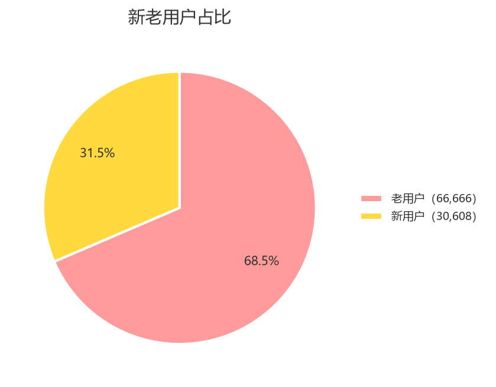

性别（女 60.9% / 男 39.1%）

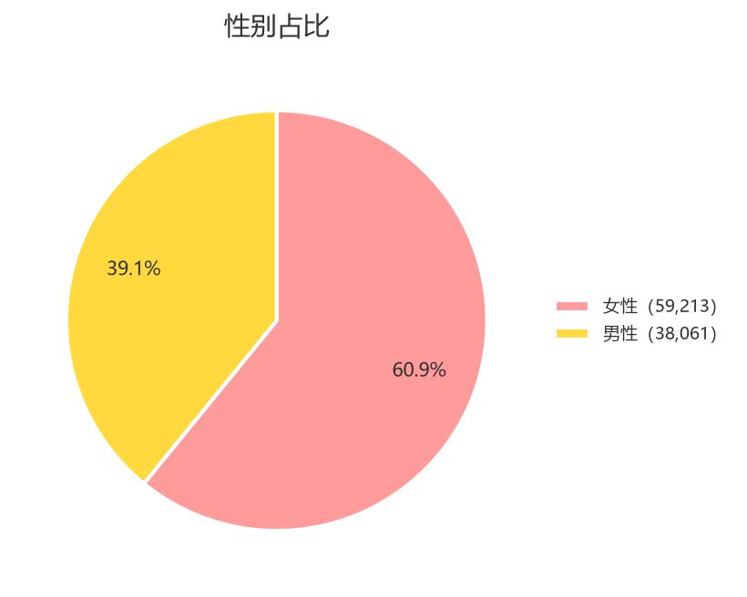

用户地区（市场1 58.1% / 市场2 17.8% / 市场3 17.9% / 市场4 6.2%）

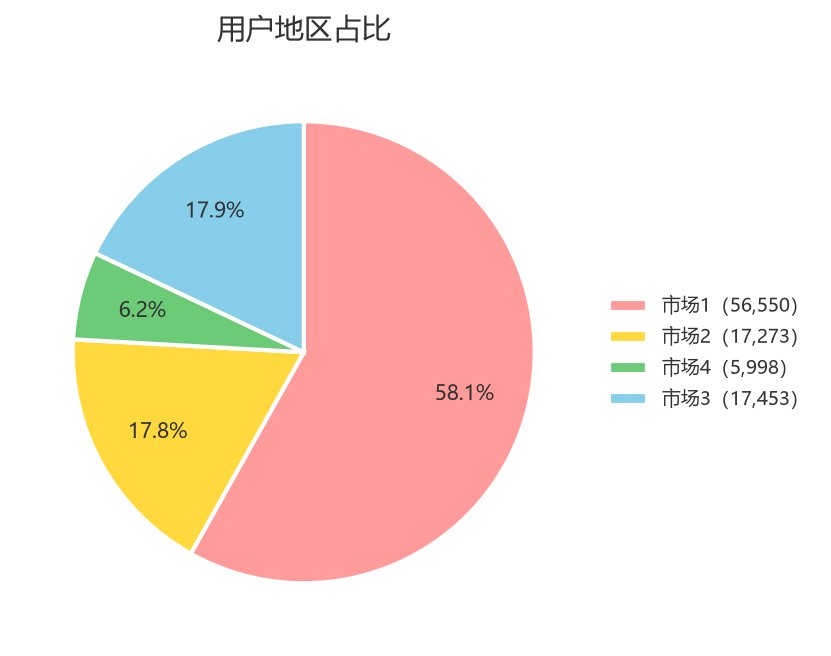

访问设备（移动端 60.5% / 桌面端 39.6%）

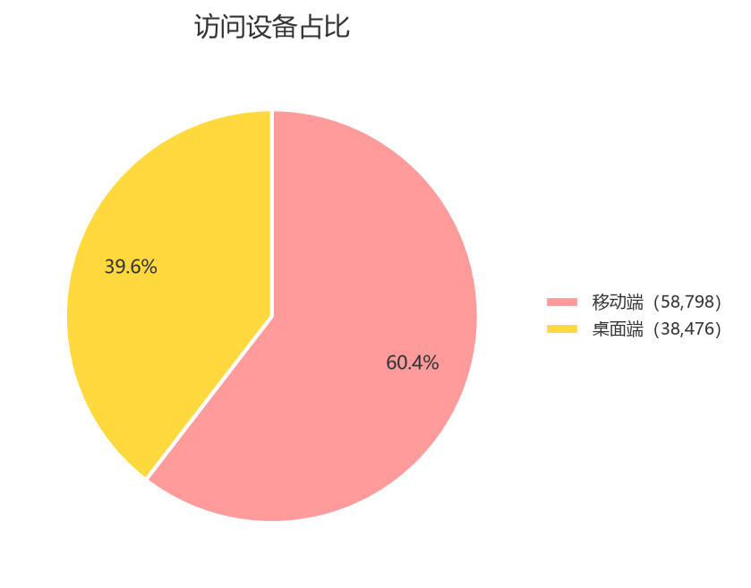

操作系统（Windows 29.9% / iOS 28.7% / Android 27.3% / macOS 8.5% / 其他 4.5% / Linux 1.1%）

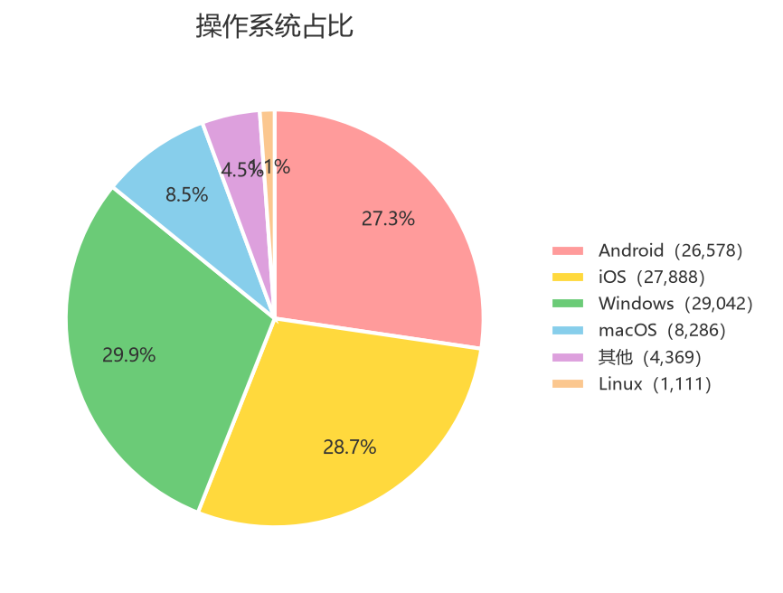

流量来源（直接访问 56.8% / 搜索引擎 28.4% / 广告投放 14.9%）

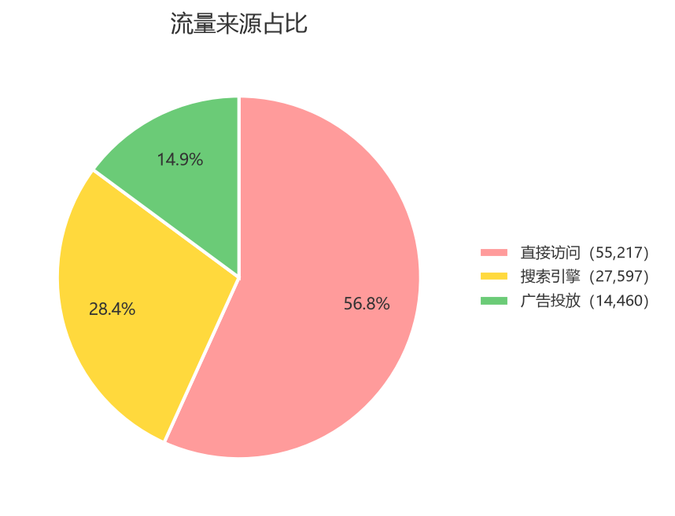

年龄分布（21-30 岁 42.7% / 31-40 岁 35.3% / 41 岁及以上 11.3% / 20 岁及以下 10.8%）

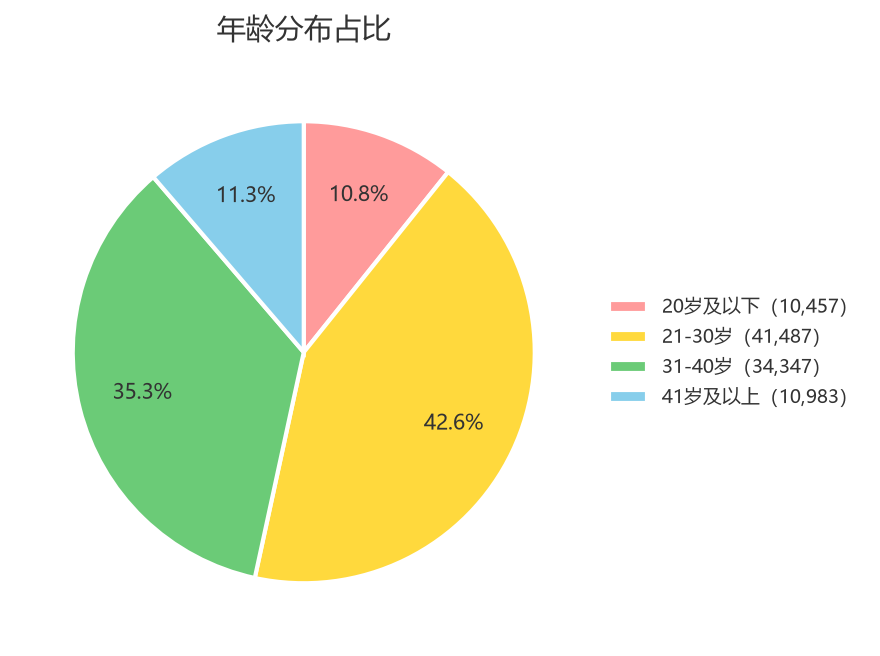

用户活跃度（低活跃度 49.7% / 中活跃度 36.6% / 高活跃度 13.7%）

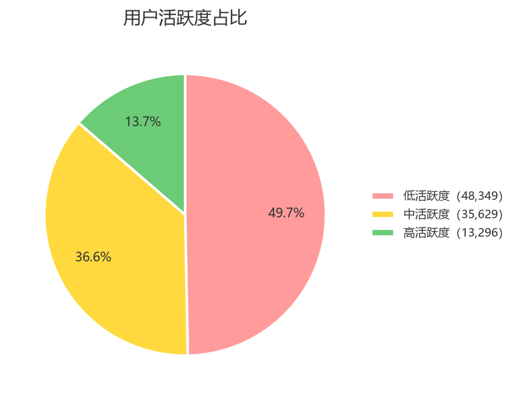

**分析**

样本的几个结构特征直接决定了后面结果的可读性。

**样本偏年轻**。21-40 岁占了 78%，41 岁以上只有 11.3%。后面如果发现"41 岁以上转化率极低"，要意识到这个群体的样本量本身就不大（10,983 条），结论的稳定性需要另外检验。

**移动端为主但不是压倒性**。移动端 60.5%、桌面端 39.6%，两者都有足够的样本量支撑对比，不会因为某个群体太小而无法比较。

**流量来源高度集中在直接访问**。Direct 占了 56.8%，Seo 和 Ads 各占约三成和一成半。这个结构意味着"来源"这个维度上的差异，很大程度上是直接访问用户在主导整体水平。

**活跃度分箱的分布需要注意**。按 `< 5` / `< 10` / `≥ 10` 分箱后，低活跃度占了将近一半（49.7%）。这个比例本身只是分箱规则的产物，但它后面的含义很关键——留到漏斗分析和列联表部分再展开。

**配色与风格**：全部图表统一使用马卡龙色系（`#FF9B9B` / `#FFD93D` / `#6BCB77` / `#87CEEB` / `#DDA0DD` / `#FBC78F`）、Microsoft YaHei 中文字体、白底无边框。同一项目内保持一套配色，是为了让读者在不同图之间比对时不被颜色干扰。

---

## 八、步骤 5｜转化漏斗分析

**目标**：量化四个阶段的转化率，找出流失最严重的位置。

**核心代码**（SQL）

```sql
-- 第一段：首页 → 列表页
SELECT
	CONCAT(ROUND(SUM(listing_page)/SUM(home_page)*100,2),"%") AS '首页到列表页转化率',
	SUM(listing_page) AS '到达列表页会话数',
	SUM(home_page) AS '到达首页会话数'
FROM user_action;

-- 第二段：列表页 → 商品详情页
SELECT
	CONCAT(ROUND(SUM(product_page)/SUM(listing_page)*100,2),"%") AS '列表页到详情页转化率',
	SUM(product_page) AS '到达详情页会话数',
	SUM(listing_page) AS '到达列表页会话数'
FROM user_action;

-- 第三段：商品详情页 → 支付页
SELECT
	CONCAT(ROUND(SUM(payment_page)/SUM(product_page)*100,2),"%") AS '详情页到支付页转化率',
	SUM(payment_page) AS '到达支付页会话数',
	SUM(product_page) AS '到达详情页会话数'
FROM user_action;

-- 第四段：支付页 → 确认页
SELECT
	CONCAT(ROUND(SUM(confirmation_page)/SUM(payment_page)*100,2),"%") AS '支付页到确认页转化率',
	SUM(confirmation_page) AS '到达确认页会话数',
	SUM(payment_page) AS '到达支付页会话数'
FROM user_action;

-- 整体转化率：首页 → 确认页
SELECT
	CONCAT(ROUND(SUM(confirmation_page)/SUM(home_page)*100,2),"%") AS '整体转化率'
FROM user_action;
```

**输出**

| 阶段 | 到达会话数 | 段转化率 | 绝对流失 |
| --- | --- | --- | --- |
| 首页 | 97,274 | — | — |
| 列表页 | 71,684 | 73.69% | 25,590 |
| 商品详情页 | 47,922 | 66.85% | 23,762 |
| 支付页 | 6,052 | 12.63% | **41,870** |
| 确认页 | 1,684 | 27.83% | 4,368 |
| **整体** | — | **1.73%** | — |

**分析**

整体转化率只有 **1.73%**——每 100 次会话最终只有不到 2 次走到确认页。

**四段里问题最突出的是"详情页 → 支付页"**，转化率仅 12.63%，也就是说每 100 个到达商品详情页的会话，只有约 13 个继续走到支付页。这一段同时还有另一个特征：它的**绝对流失量也是最大的**（41,870 次会话），比第二大的"首页 → 列表页"（25,590）还高出六成。

两个指标指向同一个位置，这在漏斗分析里是个很好的信号。转化率最低的环节不一定是最该优先处理的环节——如果某个环节本身流量很小，即使转化率很低，能挽回的绝对量也有限。这里的情况是**比率和绝对量同时指向"详情页 → 支付页"**，因此这个结论对"应该优先改哪一环"这类判断是比较稳健的。

另一个容易被忽略的点：**支付页 → 确认页只有 27.83%**，这是第二低的一段。到达支付页的用户已经是全程意愿最强的群体（他们已经点了支付），结果其中七成多没有走到确认页。绝对流失量只有 4,368，规模不大，但这 4,368 次会话的"含金量"远高于前面几段的流失——他们是已经走到最后一步的人。在业务判断上，这一段的优先级可能被绝对量低估。

**一个方法论提醒**：这张漏斗表隐含了一个假设——"到达下一阶段的人一定经过了上一阶段"。这个假设在本数据里成立（漏斗完全单调，五列标志位之间没有任何违规组合），但它不是自动成立的，遇到真实埋点数据时应当先验证。一个直接的检查方式是逐行核验五个标志位是否满足单调性（`home_page ≥ listing_page ≥ product_page ≥ payment_page ≥ confirmation_page`），只要出现违例，就说明埋点或口径有问题，这张漏斗表不能直接用。

---

## 九、步骤 6｜单项平均转化率

**目标**：把转化率按各个维度拆开，看不同人群的转化表现差异。

**核心代码**（SQL）

```sql
-- 性别维度的平均转化率
SELECT
	sex,
	CONCAT(ROUND(SUM(confirmation_page)/COUNT(*)*100,2),"%") AS '平均转化率'
FROM user_action
GROUP BY sex;

-- 活跃度维度的平均转化率
SELECT
	CASE
		WHEN total_pages_visited < 5 THEN '低活跃度'
		WHEN total_pages_visited < 10 THEN '中活跃度'
		ELSE '高活跃度'
	END AS activity_band,
	CONCAT(ROUND(SUM(confirmation_page)/COUNT(*)*100,2),"%") AS '平均转化率'
FROM user_action
GROUP BY activity_band;
```

其余六个维度（新老用户、年龄段、地区、设备、操作系统、来源）写法相同，把维度字段换掉即可。年龄和活跃度在数据库里没有现成的分箱列，用 `CASE` 在查询里现分。

**输出**

| 维度 | 转化率 |
| --- | --- |
| 新老用户 | 老用户 2.03%，新用户 1.09% |
| 性别 | 女性 2.16%，男性 1.07% |
| 年龄 | ≤20 岁 2.90%，21-30 岁 2.18%，31-40 岁 1.33%，41 岁及以上 0.17% |
| 用户地区 | 市场1 1.74%，市场2 1.96%，市场3 1.24%，市场4 2.40% |
| 访问设备 | 移动端 1.66%，桌面端 1.84% |
| 操作系统 | macOS 2.76%，Android 1.75%，iOS 1.69%，Windows 1.62%，其他 0.96%，Linux 0.63% |
| 流量来源 | 直接访问 2.15%，搜索引擎 1.18%，广告投放 1.18% |
| 活跃度 | 低 0%，中 0.85%，高 **10.39%** |

**分析**

**年龄是形态最干净的一个维度**。转化率随年龄段单调下降：2.90% → 2.18% → 1.33% → 0.17%。41 岁以上几乎不转化，这个落差（2.90% 对 0.17%，相差 17 倍）是八个维度里最大的。

**性别差异约为两倍**：女性 2.16%，男性 1.07%。

**来源维度上，搜索引擎和广告投放几乎一样**（都是 1.18%），且都明显低于直接访问（2.15%）。两者数值上只差 0.01 个百分点，看不出区别，这个问题在后面用统计检验进一步确认。

**操作系统的 macOS 是个孤立的点**：2.76%，比其余各档高出约 1 个百分点。考虑到 macOS 的样本量有 8,286 条，不是小样本噪声，这个差异值得关注。

**活跃度这一行看起来效果最惊人——低活跃度转化率恰好是 0%（0 / 48,349），高活跃度 10.39%，差距看上去极其悬殊。但这一行不能按字面理解。**

原因在于变量之间的结构性关系：走完整个漏斗至少需要浏览 5 个页面（首页、列表页、详情页、支付页、确认页各一次），而"低活跃度"的定义正是"浏览页面数少于 5"。**两者在定义上就是互斥的**——一个会话只要转化了，它的 `total_pages_visited` 必然 ≥ 5，因此必然不会被分到低活跃度组。那个 0% 不是一个经验发现，而是一个恒等式。

往上一层看，"活跃度是转化的关键驱动因素"这个结论也接近循环论证：转化这个动作本身会机械地增加浏览页面数。用浏览深度去解释转化，相当于用结果的一部分去预测结果。要检验"活跃度"是否真有独立作用，需要换一个不与转化共享定义的活跃度度量（例如只看进入漏斗早期的行为），并把转化终点前移——比如把转化重新定义为"到达支付页"，此时浏览深度就不再是转化的定义组成部分，活跃度与转化之间的那层恒等关系也就解开了。

---

## 十、步骤 7｜交叉分析

**目标**：单变量分析把每个维度单独看了一遍，但看到的是边际关系。交叉分析要看的是——不同人群之间的差异是不是一致的，也就是**交互作用**。

这一步的做法不是先画图再看，而是先用似然比检验筛出哪些交互真实存在，只给显著的组合画图。不显著的交互画出来就是一组平行线，白占版面。

**核心代码**（`code/04_cross_bar_charts.py` 检验段）

```python
MODEL_TERMS = ['age', 'sex', 'new_user', 'market', 'operative_system', 'source']
BASE_FORMULA = 'confirmation_page ~ ' + ' + '.join(
    t if t in ('age', 'new_user') else f'C({t})' for t in MODEL_TERMS
)

base_res = smf.logit(BASE_FORMULA, data=model_df).fit(disp=0)

for a, b in CANDIDATE_INTERACTIONS:
    res = smf.logit(f'{BASE_FORMULA} + {_term(a)}:{_term(b)}', data=model_df).fit(disp=0)
    lr = 2 * (res.llr - base_res.llr)
    dof = int(res.df_model - base_res.df_model)
    interaction_rows.append({
        '交互项': f'{a} × {b}',
        'LR 卡方': round(lr, 2),
        '自由度': dof,
        'p值': stats.chi2.sf(lr, dof),
    })

interaction_table['BH校正p值'] = _benjamini_hochberg(interaction_table['p值'].values)
```

**输出：交互项似然比检验**（逐个加入主效应模型，看是否显著改善拟合）

| 交互项 | LR 卡方 | 自由度 | p 值 | BH 校正 p |
| --- | --- | --- | --- | --- |
| new_user × source | 48.13 | 2 | 3.540e-11 | 4.071e-10 |
| age × operative_system | 56.85 | 5 | 5.428e-11 | 4.071e-10 |
| sex × operative_system | 54.88 | 5 | 1.383e-10 | 6.914e-10 |
| sex × age | 24.70 | 1 | 6.692e-07 | 2.510e-06 |
| sex × source | 14.13 | 2 | 8.563e-04 | 2.569e-03 |
| source × age | 11.33 | 2 | 3.459e-03 | 8.648e-03 |
| new_user × age | 7.93 | 1 | 4.872e-03 | 1.044e-02 |
| sex × device | 10.11 | 2 | 6.368e-03 | 1.194e-02 |
| new_user × sex | 6.15 | 1 | 1.312e-02 | 2.186e-02 |
| device × source | 7.60 | 3 | 5.503e-02 | 8.254e-02 |
| （主效应）device 增量 | 1.70 | 1 | 1.919e-01 | 2.617e-01 |
| source × market | 5.43 | 6 | 4.895e-01 | 6.119e-01 |
| new_user × market | 1.93 | 3 | 5.874e-01 | 6.777e-01 |
| age × market | 1.72 | 3 | 6.325e-01 | 6.777e-01 |
| sex × market | 0.08 | 3 | 9.939e-01 | 9.939e-01 |

因为一次做了 15 个检验，这里用 Benjamini-Hochberg 法对 p 值做了多重检验校正，控制错误发现率。

**这张表怎么决定画哪四张图**

画的是交互显著、且强度靠前的四个组合：`new_user × source`、`sex × operative_system`、`sex × age`、`sex × source`。

**关键的一行是"（主效应）device 增量"**：在已经含有 `operative_system` 的模型里再加入 `device`，LR 卡方只有 1.70，p = 0.192，完全不显著。这说明 `device` 不携带任何超出操作系统之外的信息。查交叉表可以确认原因：

| device | android | iOS | linux | mac | other | windows |
| --- | --- | --- | --- | --- | --- | --- |
| desktop | 0 | 0 | 1111 | 8286 | 37 | 29042 |
| mobile | 26578 | 27888 | 0 | 0 | 4332 | 0 |

桌面端只可能是 windows / mac / linux，移动端只可能是 android / iOS，只有 `other` 两边都有（37 和 4,332）。两个变量几乎是一一对应的关系。因此最终选择了信息更细的 `operative_system`（`sex × operative_system` 的 LR 为 54.88，是 `sex × device` 的 10.11 的五倍多）——device 只有两个水平，会把 macOS 这个异常点和 windows / linux 混在一起。

**另一类否定性的结论同样重要**：四个含 `market` 的交互（与 sex、age、new_user、source）p 值全在 0.49 到 0.99 之间。市场作为主效应是显著的，但它和任何变量都没有交互——市场的影响在各人群中是同向同幅度的。这类变量单独画一张主效应图就够了，展开成交叉图只会得到几条平行线。**不是所有显著的主效应都值得展开成交叉图**。

**核心代码**（绘图段）

```python
CROSS_CHARTS = [
    ('sex_source', 'sex', 'source'),
    ('newuser_source', 'new_user', 'source'),
    ('sex_os', 'sex', 'operative_system'),
    ('sex_age', 'sex', 'age_band'),
]

for fname, hue_dim, x_dim in CROSS_CHARTS:
    sql = (
        f'SELECT {DIM_EXPR[hue_dim]} AS hue, {DIM_EXPR[x_dim]} AS x, '
        f'COUNT(*) AS n, SUM(confirmation_page) / COUNT(*) AS rate '
        f'FROM user_action GROUP BY hue, x'
    )
    df = pd.read_sql(sql, engine)

    pivot = df.pivot(index='x', columns='hue', values='rate')
    pivot = pivot.reindex(index=DIM_ORDER[x_dim], columns=DIM_ORDER[hue_dim]).fillna(0) * 100

    x = np.arange(len(pivot.index))
    n_hue = len(pivot.columns)
    width = 0.8 / n_hue

    fig, ax = plt.subplots(figsize=(8, 5))
    for i, col in enumerate(pivot.columns):
        offset = (i - (n_hue - 1) / 2) * width
        bars = ax.bar(x + offset, pivot[col].values, width,
                      label=DIM_LABEL[hue_dim].get(col, col),
                      color=PALETTE[i], edgecolor='white', linewidth=1)
        ax.bar_label(bars, fmt='%.2f%%', fontsize=8, padding=2)

    ax.set_ylabel('整体转化率（%）')
    ax.set_title(f'{DIM_CN[hue_dim]} × {DIM_CN[x_dim]} 的整体转化率')
    ax.legend(frameon=False)
```

**输出：四张交叉图**

性别 × 流量来源

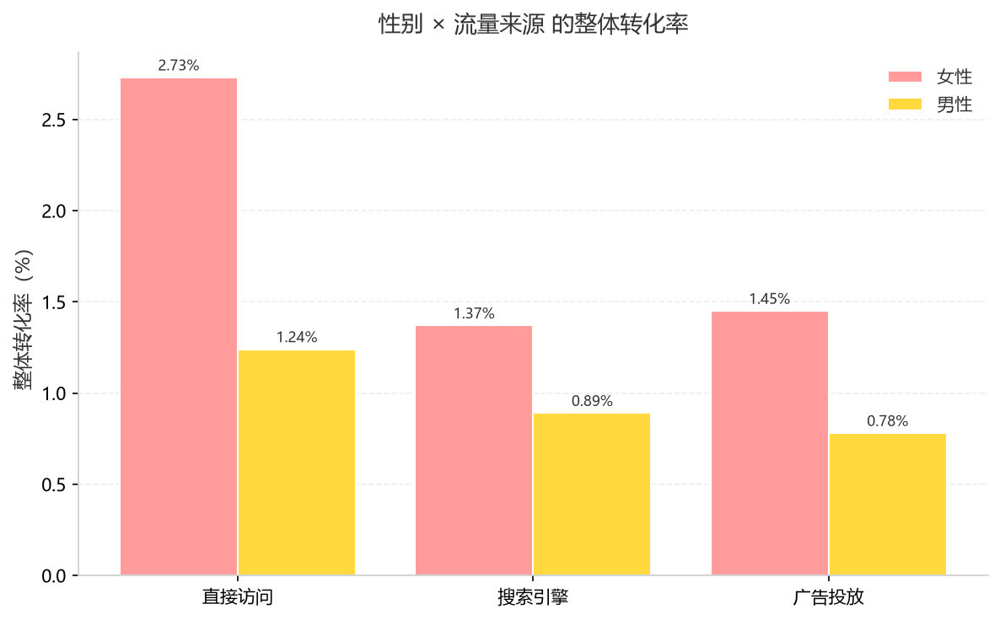

新老用户 × 流量来源

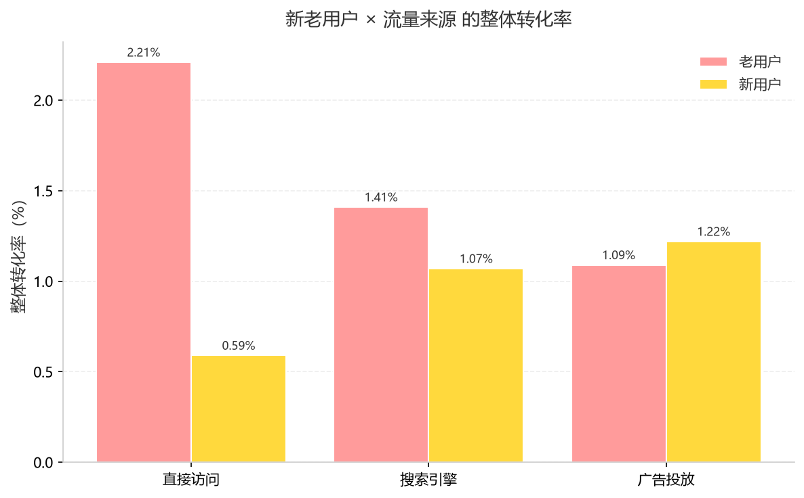

性别 × 操作系统

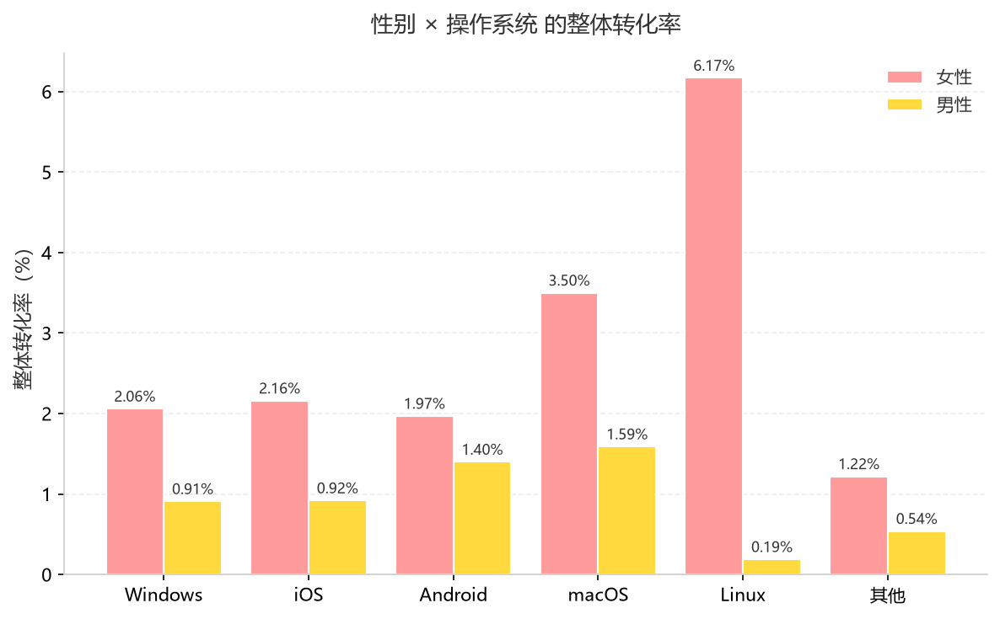

性别 × 年龄段

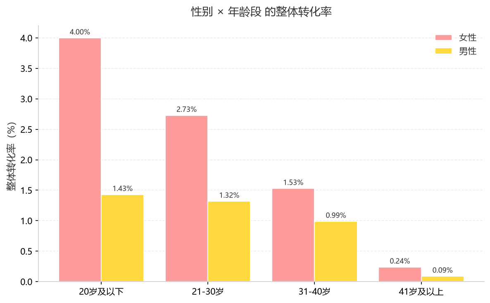

**分析**

**性别差异在所有渠道里都存在**。直接访问、搜索引擎、广告投放三个渠道里，女性的转化率都高于男性，且幅度接近，这是一个稳定的主效应而非某个渠道的特例。

**新老用户的差异在不同渠道里幅度不同**。老用户在直接访问渠道上的优势尤其明显。这一点和"新用户对站点不熟、需要更多引导"的业务直觉是吻合的，但注意这只是描述，本项目没有做因果识别。

**操作系统上，macOS 的优势在男女两个群体里都在**。图中 macOS 那一组的两根柱子都明显高于其他操作系统，说明这不是性别和系统之间的交互造成的假象，而是一个独立存在的效应。

**年龄的影响在性别上略有不同**。低龄段男女差距相对小，高龄段差距拉开——但因为 41 岁以上本身就几乎不转化（总体 0.17%），这个"拉开"是在极低水平上的拉开，解读时要谨慎。

**一个必须同时说明的背景**：这些交互在 n = 97,274 的样本量下统计上完全站得住，但**实际幅度都不大**。把所有交互加进模型后，伪 R² 只从 0.0480 提升到 0.0497。也就是说这些交叉图揭示的差异是真实的，但量级普遍在一到两个百分点之间。看图时不能只盯柱高，要记得转化率的绝对水平只有 1.73%，2.16% 和 1.07% 的差别放到业务量上可能很大，也可能被其他因素淹没。

---

## 十一、步骤 8｜列联表与卡方检验

**目标**：前面各维度都算了转化率，但看到差异不等于差异真实存在。这一步用列联表卡方检验，正式回答"性别、年龄这些指标和转化率到底有没有关系"。

**核心代码**（`code/05_contingency_analysis.py`）

```python
OUTCOME = 'confirmation_page'

for dim_name, expr in DIM_EXPR.items():
    df = pd.read_sql(
        f'SELECT {expr} AS dim, {OUTCOME} AS y, COUNT(*) AS n '
        f'FROM user_action GROUP BY dim, y',
        engine,
    )

    # 列联表：行 = 维度取值，列 = 未转化 / 转化
    table = df.pivot(index='dim', columns='y', values='n')
    table = table.reindex(index=DIM_ORDER[dim_name], columns=[0, 1]).fillna(0).astype(int)
    table.columns = ['未转化', '转化']

    # 卡方检验：2 x k 列联表，统一不做 Yates 连续性修正（n 很大时影响可忽略）
    chi2, p, dof, expected = stats.chi2_contingency(table.values, correction=False)
    min_expected = expected.min()
    cramers_v = np.sqrt(chi2 / (n_total * (min(table.shape) - 1)))
```

一次跑了 8 个检验，所以同样对 p 值做了 BH 校正。

**输出：汇总表**（按 p 值升序）

| 维度 | 卡方 | 自由度 | p 值 | BH 校正 p | Cramér's V | 转化率区间 |
| --- | --- | --- | --- | --- | --- | --- |
| 活跃度 | 6869.31 | 2 | ≈0（下溢） | ≈0 | **0.2657** | 0% ~ 10.39% |
| 年龄段 | 323.22 | 3 | 9.389e-70 | 3.756e-69 | 0.0576 | 0.17% ~ 2.90% |
| 性别 | 161.00 | 1 | 6.841e-37 | 1.824e-36 | 0.0407 | 1.07% ~ 2.16% |
| 流量来源 | 130.35 | 2 | 4.952e-29 | 9.904e-29 | 0.0366 | 1.18% ~ 2.15% |
| 新老用户 | 108.62 | 1 | 1.965e-25 | 3.143e-25 | 0.0334 | 1.09% ~ 2.03% |
| 操作系统 | 77.51 | 5 | 2.789e-15 | 3.719e-15 | 0.0282 | 0.63% ~ 2.76% |
| 用户地区 | 46.28 | 3 | 4.953e-10 | 5.661e-10 | 0.0218 | 1.24% ~ 2.40% |
| 访问设备 | 4.44 | 1 | 3.514e-02 | 3.514e-02 | 0.0068 | 1.66% ~ 1.84% |

以性别为例，具体列联表为：

| 性别 | 未转化 | 转化 | 合计 | 转化率 |
| --- | --- | --- | --- | --- |
| Female | 57,936 | 1,277 | 59,213 | 2.16% |
| Male | 37,654 | 407 | 38,061 | 1.07% |

**分析**

**八个维度全部"显著"**——最小的 p 值也有 0.035，都小于 0.05。如果只看这一列，结论会是"性别、年龄、来源、设备……和转化率全都有关系"。

**但 p 值在这个样本量下几乎没有区分能力。** 卡方统计量随样本量线性增长，n = 97,274 意味着任何一点微小的真实差异都会被判成显著。p 值能回答"有没有关系"（答案是都有），但回答不了"关系有多大"——那要看 Cramér's V。

**看 Cramér's V 这一列，情况完全不同**。除了活跃度（0.2657），其余全部落在 0.0068 到 0.0576 之间。按通常的判读标准，0.1 以下属于极弱关联。也就是说：**性别、年龄、来源这些和转化率统计上相关，但关联强度很弱**。这个区分是列联表分析里最容易翻车的地方——"显著"不等于"重要"，在有近十万条数据的场景下尤其如此。

**活跃度那一行不能当结论用**。它的 Cramér's V = 0.2657 是全表最大，看起来是"最强的驱动因素"，但这个数值来自一个恒等式：低活跃度组（`total_pages_visited < 5`）的转化数是**恰好 0 / 48,349**。走完漏斗至少要浏览 5 个页面，低活跃度的定义与转化互斥，卡方统计量之所以爆到 6,869，是因为它在检验一个定义上的必然结果。这正是步骤 6 里已经指出过的问题，在此得到了统计上的印证。

**卡方近似的前提也做了检查**：各维度交叉表的最小期望频数分别是 658.9（性别）、181.0（年龄段）、103.8（地区）、666.1（设备）、**19.2（操作系统）**、250.3（来源）、529.9（新老用户）、230.2（活跃度），全部大于 5，卡方近似可用。

---

## 十二、步骤 9｜逻辑回归建模

**目标**：列联表一次只看一个变量，无法回答"控制了其他变量之后，年龄还有没有独立影响"。逻辑回归把多个变量同时放进模型，互为控制。

**核心代码**（`code/06_logistic_regression.py`）

```python
OUTCOME = 'confirmation_page'

# 设定参照组：Categorical 的第一个水平 = 参照组
CATEGORY_ORDER = {
    'sex': ['Male', 'Female'],
    'market': [1, 2, 3, 4],
    'device': ['mobile', 'desktop'],
    'operative_system': ['windows', 'iOS', 'android', 'mac', 'linux', 'other'],
    'source': ['Direct', 'Seo', 'Ads'],
}
for col, order in CATEGORY_ORDER.items():
    df[col] = pd.Categorical(df[col], categories=order)

# age 保持连续（不分箱），new_user 本身是 0/1，直接作为数值变量
CONTINUOUS_TERMS = ['age', 'new_user']
TERMS = ['age', 'sex', 'new_user', 'market', 'device', 'operative_system', 'source']

# 多变量模型剔除 device：它与 operative_system 近似共线，
# 而 operative_system 是更细的划分，保留它
MODEL_TERMS = [t for t in TERMS if t != 'device']
FORMULA = f'{OUTCOME} ~ ' + ' + '.join(
    t if t in CONTINUOUS_TERMS else f'C({t})' for t in MODEL_TERMS
)

model = smf.logit(FORMULA, data=df).fit(disp=0)
```

**运行前的一次修正**

第一版多变量模型跑出来的结果是废的：

| 变量 | OR | 95% 置信区间 |
| --- | --- | --- |
| device = desktop | 3.0407 | 0.4005 – 23.0864 |
| operative_system = iOS | 3.1868 | 0.4180 – 24.2955 |
| operative_system = android | 3.3341 | 0.4373 – 25.4196 |

置信区间宽到 0.4 到 23 这种程度，说明系数估计完全不可信。原因是 `device` 和 `operative_system` 高度重合（见步骤 7 的交叉表），同时入模时两者互相抢夺解释力，标准误被放大。因此脚本里加了一段共线性诊断，并**把 `device` 从多变量模型中剔除**（保留更细的 `operative_system`）。单变量模型里两个变量都保留，便于对照。

**输出：单变量逻辑回归**（各自单独入模，未调整）

| 变量 | OR | 95% 置信区间 | p 值 |
| --- | --- | --- | --- |
| age（每增 1 岁） | 0.9368 | 0.9303 – 0.9433 | 2.300e-75 |
| 女性（vs 男性） | 2.0392 | 1.8226 – 2.2816 | 1.701e-35 |
| 新用户（vs 老用户） | 0.5318 | 0.4713 – 0.6000 | 1.105e-24 |
| 市场2 | 1.1293 | 0.9970 – 1.2792 | 5.582e-02 |
| 市场3 | 0.7069 | 0.6095 – 0.8199 | 4.518e-06 |
| 市场4 | 1.3876 | 1.1626 – 1.6562 | 2.844e-04 |
| desktop（vs mobile） | 1.1106 | 1.0073 – 1.2245 | 3.521e-02 |
| iOS | 1.0398 | 0.9141 – 1.1828 | 5.524e-01 |
| android | 1.0802 | 0.9492 – 1.2292 | 2.420e-01 |
| mac | 1.7241 | 1.4695 – 2.0229 | 2.386e-11 |
| linux | 0.3846 | 0.1819 – 0.8132 | 1.237e-02 |
| other | 0.5888 | 0.4287 – 0.8086 | 1.066e-03 |
| 搜索引擎（vs 直接访问） | 0.5463 | 0.4829 – 0.6180 | 7.101e-22 |
| 广告投放 | 0.5452 | 0.4639 – 0.6407 | 1.741e-13 |

**输出：多变量逻辑回归**

`confirmation_page ~ age + C(sex) + new_user + C(market) + C(operative_system) + C(source)`

参照组：男性 / 老用户 / 市场1 / windows / 直接访问

| 变量 | OR | 95% 置信区间 | p 值 |
| --- | --- | --- | --- |
| 女性（vs 男性） | 2.0437 | 1.8250 – 2.2886 | 3.493e-35 |
| age（每增 1 岁） | 0.9357 | 0.9291 – 0.9423 | 6.003e-76 |
| 新用户（vs 老用户） | 0.7190 | 0.6123 – 0.8443 | 5.729e-05 |
| 市场2 | 1.1152 | 0.9839 – 1.2640 | 8.811e-02 |
| 市场3 | 0.7254 | 0.6251 – 0.8418 | 2.351e-05 |
| 市场4 | 1.3518 | 1.1314 – 1.6151 | 9.023e-04 |
| iOS | 1.0480 | 0.9208 – 1.1928 | 4.772e-01 |
| android | 1.0965 | 0.9630 – 1.2485 | 1.643e-01 |
| mac | 1.7345 | 1.4769 – 2.0370 | 1.898e-11 |
| linux | 0.5886 | 0.2772 – 1.2501 | 1.679e-01 |
| other | 0.5954 | 0.4332 – 0.8184 | 1.397e-03 |
| 搜索引擎（vs 直接访问） | 0.6634 | 0.5694 – 0.7729 | 1.398e-07 |
| 广告投放 | 0.6739 | 0.5579 – 0.8140 | 4.218e-05 |

**模型整体**：n = 97,274，McFadden 伪 R² = 0.0480，LLR 检验 p = 5.074e-166，AUC = 0.6939，基准转化率 1.73%。

**分析**

**年龄的效应非常稳定**。单变量 OR = 0.9368，控制其他变量后 OR = 0.9357，几乎没动。这说明年龄与转化率的关系不是被性别、来源这些变量"带"出来的，而是一个独立存在的效应。

OR = 0.936 的含义是：年龄每增加一岁，转化的**几率**（odds）变成原来的 0.936 倍，即下降约 6.4%。换算到十年：0.9357 的十次方约为 0.51——**年龄每大十岁，转化几率大约减半**。这种"每单位 OR 的累加换算"在写报告时比单看系数直观得多，也是逻辑回归相比卡方检验更容易向业务方解释的地方。

**性别同样稳健**：单变量 2.0392，多变量 2.0437，女性的转化几率约为男性的两倍。

**代价是模型整体解释力很弱**。McFadden 伪 R² 只有 0.0480，AUC = 0.6939。这和步骤 8 里 Cramér's V 全部低于 0.06 是同一个事实的两种表述：性别、年龄、来源这些人口属性与转化率只是弱相关。AUC 0.69 意味着模型的区分能力比随机猜测（0.5）好，但离可用还有距离，不应把接近 0.7 当成好消息。

**调整前后结论会变，这是建模的意义所在**。`linux` 在单变量模型里 OR = 0.3846、p = 0.012（显著），进了多变量模型后 OR = 0.5886、p = 0.168（不显著）。原因是 linux 只有 1,111 条样本，且它几乎是 desktop 的子集，控制其他变量后这点效应撑不住了。如果只停在列联表或单变量分析，就会把一个不稳健的效应写进结论。

**模型里没有放进浏览行为变量**。`total_pages_visited` 与转化率的关联是全表最强的，但它和确认页在结构上互相定义（走完漏斗至少要浏览 5 个页面），放进模型等于用结果的一部分预测结果。这个取舍本身就是本项目的一个判断点。

---

## 十三、步骤 10｜用户画像分析

**目标**：前面九步都在回答"什么因素和转化有关"。这一步换一个方向，直接刻画转化人群本身——到达确认页的那 1,684 次会话，在六个特征上分别"最典型"的样子是什么。

**图形设计**：一个大圆代表全部 1,684 次转化会话；对每个特征，只取转化人群中占比最高的那一个取值，画成大圆内部的一个小圆，**小圆面积与该取值的会话数严格成正比**。六个特征各出一个圆，装在同一个大圆里。

这个画法有两点必须交代：

**六个小圆不是大圆的划分。** 它们来自同一批人的不同切面，彼此重叠——"女性"和"老用户"描述的是同一批人身上的两个标签，不是两拨人。所以小圆面积可以横向比较（谁大谁小），但不能相加，也不能读成"占了多大比例的空间"。大圆只提供"这些人"这个容器的含义。

**圆无法无缝铺满。** 能无缝铺满的是矩形（即树图），圆与圆之间必然有缝隙。本图中六个小圆合计占大圆面积约 56%，留白比例由几何决定，不是人为缩小。

**核心代码**（`code/07_user_profile.py`）

每个特征只取众数：

```python
for name, expr, label_map in PROFILE_FEATURES:
    df = pd.read_sql(
        f'SELECT {expr} AS v, COUNT(*) AS n FROM user_action '
        f'WHERE confirmation_page = 1 GROUP BY v ORDER BY n DESC',
        engine,
    )
    top_v, top_n = df['v'].iloc[0], int(df['n'].iloc[0])
    features.append((name, label_map.get(top_v, top_v), top_n))
```

半径取 √人数，面积就与人数严格成正比；六个圆的位置则由一个小型圆形打包问题解出——按半径从大到小逐个放置，每个圆都在所有"与已放置的圆外切"的候选位置里，挑那个让整簇包络半径最小的落点，最后统一缩放到大圆内：

```python
radii = [np.sqrt(n) for _, _, n, _ in features]
order = np.argsort(radii)[::-1]
placed, enclosing = pack_circles([radii[i] for i in order])
scale = CONTAINER_R / enclosing
```

脚本末尾留了一段断言，逐对校验"面积比 = 人数比"，确保面积编码没有被画图过程破坏：

```python
for i in range(len(features)):
    for j in range(i + 1, len(features)):
        area_ratio = layout[i][2] ** 2 / layout[j][2] ** 2
        n_ratio = features[i][2] / features[j][2]
        assert abs(area_ratio - n_ratio) < 1e-9
```

**输出：转化人群画像**

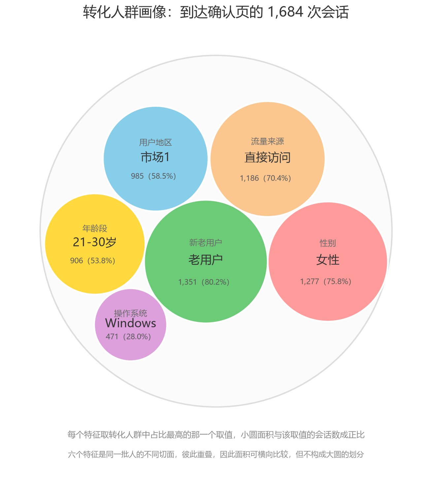

| 特征 | 占比最高的取值 | 会话数 | 占转化人群 | 次高取值 | 领先 |
| --- | --- | --- | --- | --- | --- |
| 性别 | 女性 | 1,277 | 75.8% | 男性 407 | +870 |
| 年龄段 | 21-30 岁 | 906 | 53.8% | 31-40 岁 456 | +450 |
| 新老用户 | 老用户 | 1,351 | 80.2% | 新用户 333 | +1,018 |
| 用户地区 | 市场1 | 985 | 58.5% | 市场2 339 | +646 |
| 操作系统 | Windows | 471 | 28.0% | iOS 470 | **+1** |
| 流量来源 | 直接访问 | 1,186 | 70.4% | 搜索引擎 327 | +859 |

**分析**

**一句话画像**：走完漏斗的这批人，最典型的形象是"老用户、女性、从直接访问进来、21-30 岁、来自市场1"。

**但"取最多"这个画法有一个副作用：它会掩盖接近并列的取值。** 操作系统那一格就是反例——Windows 471 次、iOS 470 次、Android 465 次，三者相差不超过 6 次会话，占比分别是 27.97%、27.91%、27.61%。这实际上是三足鼎立，**根本没有主导取值**，图里那个写着"Windows"的圆是任意的，换一个数据切片它就会变成 iOS。这一格应该读成"操作系统在转化人群里没有明显的集中倾向"，而不是"转化人群主要用 Windows"。

其余五个特征的领先幅度都很大（最少的是年龄段，也领先 450 次会话），代表取值是稳的，不会因为几个样本的出入而翻转。所以看这类"取众数"的画像时，**领先幅度比占比本身更值得看**——占比高可能只是因为类别少，领先幅度才反映集中度。

**画像和转化率仍然是两回事。** 小圆的大小表示"这个取值有多少人"，不是"这个取值有多容易转化"。最明显的是老用户：它在图里是最大的圆（1,351 次会话，80.2%），但这个体量有相当一部分来自老用户在样本里本来就占多数（全样本 68.5%），而不全是转化优势。反过来看年龄段，21-30 岁是转化人群里最大的一块（53.8%），但它的转化率（2.18%）其实低于 20 岁及以下（2.90%）——它大，是因为它本来就是最大的群体。

这两件事的关系可以写成一个恒等式：**某取值在转化人群中的占比 = 该取值在全样本中的占比 × 相对转化率**。以性别为例，女性在全样本中占 60.9%、男性 39.1%，规模比 1.557；女性转化率是男性的 2.02 倍；相乘得 3.15，恰好等于转化人群中的占比之比（75.8 / 24.2 = 3.13）。**画像是规模效应和效率效应叠加的结果**，要判断资源投往哪里，需要的是"规模 × 转化率"（对总转化量的贡献），而不是画像里的占比，也不是单独的转化率。

**有两个特征没有画进来。** 活跃度：转化人群里"低活跃度"结构性为 0（走完漏斗至少要浏览 5 个页面），而剩下的"高活跃度"1,381 次本身就是转化的同义反复，取它当画像特征是循环论证。设备：它与操作系统近似共线（步骤 7 已用似然比检验确认，p = 0.192），画出来和操作系统是同一张图，保留信息更细的那个。

**最后一句限定**：这是描述性统计，只反映本数据里转化人群的构成，不能读成"女性更容易转化、所以应该只投女性"。这些特征之间存在相关（例如女性用户在直接访问渠道中的占比更高），要把各自的独立效应分离开，需要回到步骤 9 的逻辑回归。

---
## 十四、主要结论

**一、整体转化率 1.73%，流失集中在"详情页 → 支付页"。** 这一段转化率最低（12.63%），同时绝对流失量最大（41,870 次会话），两个指标指向同一位置。其次是"支付页 → 确认页"，转化率 27.83%，绝对流失量虽小（4,368），但这部分用户是全程意愿最强的群体。

**二、性别、年龄、来源、系统这些维度与转化率统计上相关，但关联强度都很弱。** 八个维度的卡方检验全部显著（p 最小 0.035），但在 n = 97,274 下 p 值几乎没有区分能力。Cramér's V 除活跃度外全部落在 0.0068 ~ 0.0576 之间，属于极弱关联。**"显著"和"重要"在这个数据规模下必须分开谈。**

**三、年龄的负向效应稳定且可量化。** 转化率随年龄段单调下降（2.90% → 2.18% → 1.33% → 0.17%），逻辑回归中控制其他变量后 OR = 0.9357 几乎不变，即年龄每大十岁转化几率约减半。

**四、性别的差异约为两倍，且在各类渠道中都存在。** 女性 2.16% 对男性 1.07%，调整前后 OR 稳定在 2.04 左右，交叉图显示这不是个别渠道的特例。

**五、macOS 是一个独立的异常高点。** 单变量 OR = 1.7241、多变量 OR = 1.7345，远高于其他操作系统的水平，且在性别分层中依然存在。

**六、"活跃度"这一维度不能作为结论。** 低活跃度组转化率恰好为 0%（0 / 48,349），这不是数据发现——走完漏斗至少要浏览 5 个页面，而低活跃度的定义正是"浏览不足 5 页"，两者在定义上互斥。用它解释转化构成循环论证。

**七、模型整体解释力有限。** 多变量模型伪 R² = 0.0480、AUC = 0.6939。人口属性只能解释转化的一小部分，其余部分要么来自本数据未记录的因素，要么来自会话内的具体行为。

---

## 十五、优化建议

**先把排序依据定下来。** 建议最容易写成一张愿望清单，所以第一步不是列动作，而是确定"先改哪一段"用什么标准。漏斗是连乘的：

```
整体转化率 = 73.69% × 66.85% × 12.63% × 27.83% = 1.7312%
```

这个式子有一个容易被忽略的推论：**任何一段的相对提升都会 1:1 传导到整体**。让任意一段的相对转化率提高 10%，整体就提高 10%，转化会话从 1,684 变成 1,852，多 168 次。改哪一段，这个数字都一样。

| 环节 | 当前段转化率 | 相对提升 10% 需达到 | 要涨多少 | 整体转化率 | 转化会话 |
| --- | --- | --- | --- | --- | --- |
| 首页 → 列表页 | 73.69% | 81.06% | +7.37pp | 1.73% → 1.90% | +168 |
| 列表页 → 详情页 | 66.85% | 73.54% | +6.69pp | 1.73% → 1.90% | +168 |
| 详情页 → 支付页 | 12.63% | 13.89% | +1.26pp | 1.73% → 1.90% | +168 |
| 支付页 → 确认页 | 27.83% | 30.61% | +2.78pp | 1.73% → 1.90% | +168 |

所以"先改哪一段"不能看哪段转化率低，要看**哪一段的 10% 最容易拿到**。按这个标准，四段的难度差得很远：支付页 → 确认页只需要涨 2.78 个百分点，首页 → 列表页要涨 7.37 个百分点——后者牵涉流量质量和落地页，完全是另一类工作。

下面的建议按"依据 → 动作 → 预期收益"三段写。凡是数据支撑不到的，明确标成**待验证的假设**，不与数据分析结论混在一起。

### （一）环节角度

**1. 支付页 → 确认页：建议优先做这一段。**

依据是：段转化率 27.83% 为四段中第二低，绝对流失 4,368 次。但真正的理由不是"低"，而是这一段**用户已经点过支付按钮**——他们是全程意愿最强的一批人，其中七成多却没走到确认页。这是"说服问题"最不可能发生的位置，更可能是技术或流程摩擦。

动作上先查四件事：支付渠道的跳转失败率与超时率；支付页的表单字段数与填写时长；第三方支付回跳路径是否存在断点；这一段埋点是否完整上报（漏斗末端的数据缺失会伪装成流失）。在拿到这四项结果之前，不建议动页面设计。

预期收益是四段里唯一能一次拿到两位数增量的：这一段提到 35%（相对 +25.8%），整体转化率 1.73% → 2.18%，转化会话 1,684 → 2,118，**多 434 次**。

**2. 详情页 → 支付页：池子最大，但必须先补数据。**

12.63% 是全表最低，41,870 次绝对流失是全表最大，两个指标同时指向这里，这是全项目最稳的定位结论。

但**这一段的原因在现有数据里完全不可观测**。数据里没有商品、价格、库存、运费、评价，也没有停留时长。因此现在能给出的只能是假设清单，而不是方案：价格与运费超出预期；库存或发货时效劝退；详情页信息不足以支撑决策；少数 SKU 承接了大流量却不转化。这四条都没有证据——其中前两条正是原项目写到"广告素材夸大导致价格预期不符"的地方，而原项目同样没有数据支撑。在拿到商品与价格维度之前，任何"优化详情页设计"的建议都是没有依据的。

这一段每提升 10%（12.63% → 13.89%，只需 +1.26pp），整体同样多 168 次转化。

**3. 首页 → 列表页、列表页 → 详情页：量大，但更可能是流量质量问题。**

两段绝对流失 25,590 和 23,762，仅次于详情页 → 支付页。段转化率 73.69% 和 66.85% 看上去不低，但正因为基数高，10% 的相对提升要分别拿到 7.37 和 6.69 个百分点。

这两段的流失分布最均匀，符合"进来的人本来就不想买"而不是"某个环节坏了"的特征。可查两件事：一是渠道落地页，搜索引擎与广告合计占 43% 的流量，如果它们都落在首页，等于让带着明确意图来的用户先看一遍首页；二是新用户链路，新用户 OR = 0.719，且 `new_user × source` 交互显著，说明新用户在不同渠道上的落差并不一样，值得单独拆开看。

### （二）人群与渠道角度

**性别：差异真实，但不要直接拿去裁量预算。** 女性转化率 2.16% 对男性 1.07%，调整前后 OR 稳定在 2.04，且在三个渠道里都存在。但这是相关关系——如果这个站点的品类本来就偏女性，那么"女性转化高"只是品类结构的反映，不是性别本身的作用。**待验证的假设**：分品类看性别差异是否依然存在。若存在，动作应该是选品与素材倾斜；若消失，说明抓手在品类而不在性别。

**年龄：41 岁以上有两条互斥的路，需要业务判断。** 转化率 0.17%（19 / 10,983），是所有维度里落差最大的。一条路是承认这个人群不是目标客户，收缩投放；另一条是怀疑存在准入门槛——注册流程、字体大小、支付方式覆盖。这两条路的动作完全相反，而数据本身分辨不了。这条建议必须先由业务方定性，不能由数据直接推出。

**渠道：不能据此砍掉付费渠道。** 搜索引擎与广告的转化几率只有直接访问的 0.66 和 0.67 倍，看起来该压预算。但这份数据里**没有渠道成本**、没有 CAC，也没有增量性信息——付费渠道可能带来本不会来的新客，转化率低但 ROI 仍可能为正。在补上渠道成本与投放数据之前，建议只做落地页承接的优化，不动预算分配。

**地区：市场3 是唯一显著低于基准的市场。** 多变量 OR = 0.7254（p = 2.35e-05），其余三个市场都不低或略高。这个结论比性别、年龄都干净，值得单独查该市场的履约、支付方式或本地化问题。

**操作系统：macOS 的高点可能是残差，不要直接优化 mac 端。** OR = 1.7345，且在各性别分层里都在。但 mac 用户的年龄结构与大盘不同，而年龄是负向效应——也就是说 mac 用户在"年龄不利"的情况下依然转化更高。这个反常本身说明模型里漏了变量，很可能是收入或品类偏好这类本数据没有的东西。**待验证的假设**：这是设备效应还是人群效应。

### （三）数据与埋点角度

这一节的优先级不低于前面任何一条，因为**最严重的流失恰好落在原因最不可观测的位置**。

| 缺什么 | 导致哪个问题答不了 | 补上之后能做什么 |
| --- | --- | --- |
| 商品 / SKU / 价格 / 库存 | 详情页 → 支付页的流失原因完全不可知 | 定位是价格、库存还是信息问题，这是全项目最大的盲区 |
| user_id | 一行 = 一次会话，同一人多次访问无法归并 | 用户级复购与频次，以及真正的用户转化率 |
| 时间戳 | 做不了趋势、留存、同期群 | 排除大促与版本发布对漏斗的干扰，也给 A/B 定观察窗口 |
| 渠道成本 | 无法评价渠道 ROI | 在成本口径下重新判断搜索引擎与广告该加还是该减 |
| 停留时长 / 跳出 | 分不清"看了没兴趣"和"页面加载坏了" | 区分意愿问题与技术问题，直接决定详情页那一段的动作方向 |
| 支付成功标志 | `confirmation_page` 只是"到达确认页" | 澄清口径；真实成交率只会比 1.73% 更低 |
| 埋点完整性校验 | 无法排除末端漏报 | 把"流失"和"没上报"分开，否则末段建议可能建在假象上 |

### （四）分析方法角度

**p 值在这个数据规模下不能当结论用。** 八个维度的卡方检验全部显著（最小 p = 0.035），但 Cramér's V 除活跃度外全在 0.0576 以下。n ≈ 9.7 万时任何微小差异都会显著，报告里必须同时给效应量。

**模型不要上线做定向投放。** 多变量模型 AUC = 0.6939、伪 R² = 0.0480。这个区分度用来解释"哪类人更容易转化"可以，用来决定"给这个人看什么"不够——把 0.69 当成可用的排序能力，只会得到一批比随机好不了多少的名单。

**不要用"活跃度"做运营抓手。** 低活跃度转化率恰好为 0，是因为走完漏斗至少要浏览 5 个页面，而低活跃度定义为不足 5 页——两者在定义上互斥。拿它当抓手，会得到一个永远正确的指标和一堆无效动作。

**所有 OR 只能表述为相关。** 本项目没有实验设计，也没有时间维度，无法排除选择效应。要得到因果结论，需要 A/B 实验或准实验设计。

**排序要用"规模 × 转化率"的贡献度。** 画像里女性占 75.8%、老用户占 80.2%，但那是规模效应叠加效率效应的结果（见第十三节）。单看占比或单看转化率都会误判资源去向。

### （五）落地角度

**监控基线**：把整体转化率 1.73% 与四段转化率 73.69% / 66.85% / 12.63% / 27.83% 做成常驻看板。没有基线，任何改动都无法判断是有效还是波动。

**排期方法**：用 ICE（Impact / Confidence / Ease）给上面的建议打分，把分析结论翻译成需求排期。每一条都要写全"依据 → 动作 → 预期收益"，写不全的说明还停在想法阶段。

**如果只能做一件事**：先把支付页 → 确认页这一段的埋点与支付链路查清楚。它同时满足两个条件——用户意愿最强、所需提升幅度最小（这一段提到 35% 就是整体多 434 次转化）。其他改动要么收益不明（详情页那段缺数据），要么牵涉的环节太多、见效太慢。

---

## 附：数据与结果的可复现性

本文档里的每一个数字都来自 `code/` 下脚本的实际输出，没有手工计算或转抄的中间值。按第三节的执行顺序跑一遍，可以得到同样的结果；`pic/` 下的 13 张图由 `code/03_pie_charts.py`、`code/04_cross_bar_charts.py` 和 `code/07_user_profile.py` 三个脚本生成。